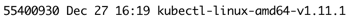
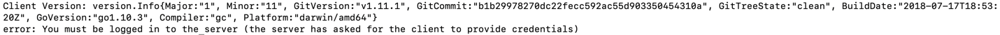

# kubectl - Installing Kubernetes CLI

## Lab objectives
 

Install the Kubernetes command line interface (CLI) kubectl.  This CLI is used to create, access, and manage Kubernetes clusters.

<b>NOTE:</b> The following instructions utilize the 'curl' command. If curl is not installed on your laptop it must first be installed to complete this lab. 

Scroll to the appropriate operating system and follow the installation instructions.  

----

&nbsp;
### &nbsp;&nbsp;macOS 

 
1 - Download the macOS CLI to install:

Replace <ICP IP> with the IP address of the IBM Cloud Private instance from where the CLI will be obtained.

	curl -kLo kubectl-darwin-amd64-v1.11.1 https://<ICP IP>:8443/api/cli/kubectl-darwin-amd64
	
Example file name from the above curl command:

2 - Rename the above downloaded file to kubectl.  

	mv kubectl-darwin-amd64-v1.11.1 kubectl
	

3 - Make the kubectl binary executable.

	chmod +x ./kubectl

4 -  Move the binary in to your PATH.

	sudo mv ./kubectl /usr/local/bin/kubectl

  

----

&nbsp;
### &nbsp;&nbsp;Linux 

 
1 - Download the Linux CLI to install:

Replace <ICP IP> with the IP address of the IBM Cloud Private instance from where the CLI will be obtained.

	curl -kLo kubectl-linux-amd64-v1.11.1 https://<ICP IP>:8443/api/cli/kubectl-linux-amd64
	
Example file name from the above curl command:

2 - Rename the above downloaded file to kubectl.  

	mv kubectl-linux-amd64-v1.11.1 kubectl
	

3 - Make the kubectl binary executable.

	chmod +x ./kubectl

4 - Move the binary in to your PATH.

	sudo mv ./kubectl /usr/local/bin/kubectl

  

----

&nbsp;
### Windows 

 

1 - Download the Windows CLI to install.

Replace <ICP IP> with the IP address of the IBM Cloud Private instance from where the CLI will be obtained.

	curl -kLo kubectl-win-amd64-v1.11.1.exe https://<ICP IP>:8443/api/cli/kubectl-win-amd64.exe
	
Example file name from the above curl command:

2 - Run the above file to install the CLI on the Windows system.

3 - Add the binary in to your PATH.

---

  

## Verify the CLI is installed

From a terminal or command prompt enter:

	kubectl version
	

Example output:

Once logged in an authenticated with a kubernetes cluster the error portion of the above message will not be shown.

----

